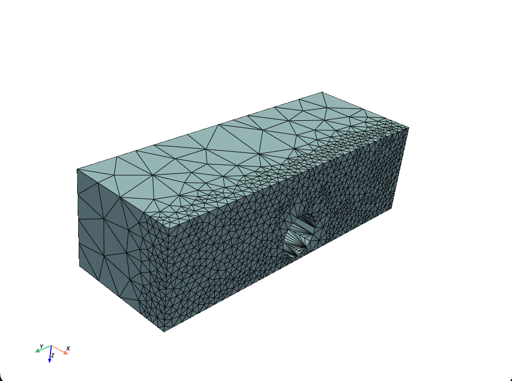

# Sizing function example

Using raw tetgen to generate a mesh with a sizing function.
This is the functionality we want to expose through the Python API.

## Usage

Build `tetgen`:

```bash
$ bash build.sh
```

Then, run the example:

```bash
$ bash run.sh
```

Inspect the output:

```bash
$ python plot.py
```

Expected output should be similar to this:



(note the uneven mesh density as a result of the sizing function)